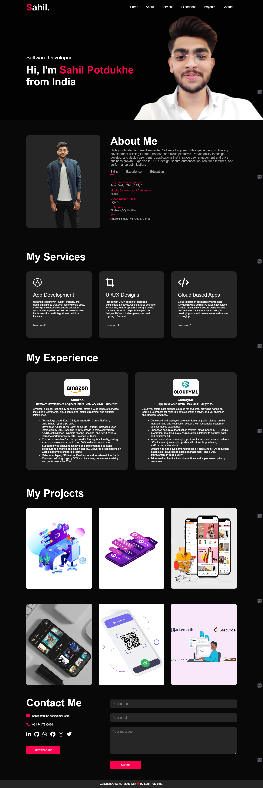

<h1 align="center"> Sahil Potdukhe's Portfolio Website</h1>

Welcome to my portfolio website! This project showcases my skills, experiences, and projects in a visually appealing and interactive manner.

## Table of Contents

- [Demo](#demo)
- [Features](#features)
- [Technologies Used](#technologies-used)
- [Installation](#installation)
- [Usage](#usage)
- [Contributing](#contributing)
- [License](#license)

## Demo

You can check out the live demo of the website [here](https://sahilpotdukhe.github.io/Portfolio-website/)

## Features

- **Responsive Design**: The website is optimized for various devices, ensuring a seamless experience for users on desktops, tablets, and mobile phones.
- **Project Showcase**: Display your projects prominently with details such as descriptions, technologies used, and links to GitHub repositories or live demos.
- **About Me Section**: Introduce yourself to visitors, highlighting your skills, experiences, and interests.
- **Contact Information**: Provide ways for visitors to get in touch with you, such as through a contact form or links to your social media profiles.
- **Interactive Elements**: Incorporate animations, transitions, or interactive elements to engage users and make your portfolio memorable.

## Technologies Used

- HTML5
- CSS3 (with frameworks like Bootstrap or Tailwind CSS)
- JavaScript (including libraries like React.js or Vue.js)

## Installation

To run this project locally, follow these steps:

1. Clone the repository: `git clone https://github.com/sahilpotdukhe/Portfolio-website.git`
2. Navigate to the project directory: `cd portfolio-website`

## Usage

After installing the project, you can:

- Modify the HTML, CSS, and JavaScript files to customize the website according to your preferences.
- Add your projects, experiences, and other content to the appropriate sections of the website.
- Test the website locally to ensure everything is functioning as expected before deploying it.

## Contributing

Contributions are welcome! If you'd like to contribute to this project, feel free to fork the repository and submit a pull request with your changes. Please follow the existing code style and guidelines.

## License

This project is licensed under the [MIT License](LICENSE).
